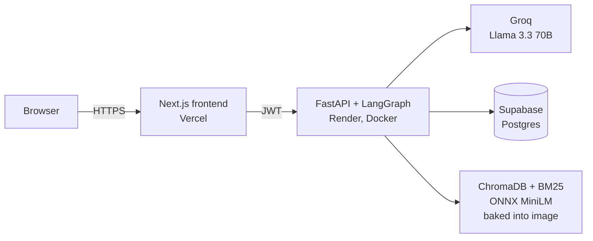

# SentioBot

A production-grade AI customer-support assistant for a fictional electronics brand (Nexora). Ask it about a product, a policy, an order, or a warranty, and it answers from real documentation with cited sources, or calls a tool to check live order and warranty data. Built as a measured, reviewed, increment-by-increment hardening workstream, not a weekend demo.

**Live demo: https://sentiobot.vercel.app**

Sign in with `alice` / `password123` (seeded demo user). The backend runs on a free scale-to-zero tier, so the first request after an idle period takes about 30 to 60 seconds to wake up; after that it is fast.


---

## What it does

- **Grounded answers.** A documentation question ("How do I install the LumiGlow bulb?") retrieves the relevant manual sections and streams a cited answer. The model is instructed to answer only from retrieved context, so it does not invent policy.
- **Actions, not just answers.** An order, warranty, or ticket request routes to a small tool-using agent that checks live data (Supabase) and can open a support ticket, scoped to the authenticated user.
- **Personalized and stateful.** It knows the signed-in user's products, keeps conversation history, and warms a cache so repeat questions are instant.

## Architecture



Two answer paths behind one streaming endpoint:

- **RAG path** (documentation questions): a hybrid ensemble retriever (BM25 0.4 + vector 0.6, k=5) finds the relevant sections; the LLM streams a cited answer token by token.
- **Tool path** (orders / warranty / tickets): a LangGraph state machine lets the model call tools, with a hard round cap plus a forced finalize node so it always converges, then streams the answer.

## Engineering highlights

The interesting part is not the happy path; it is what it took to make it trustworthy and shippable. Every step was measured and independently reviewed before it counted.

- **Measure before optimizing.** Instrumented per-request LLM calls, tokens, and latency, then cut the multi-query retriever behind a reversible flag: measured 2 LLM calls per answer down to 1, tokens down 53 percent, retrieval quality unchanged.
- **A frozen evaluation you can trust.** A 50-question golden set, hash-locked so a silent edit fails the build. Deterministic retrieval **hit@5 = 0.913** (BM25 + vector), reproduced bit-for-bit and gated in CI with zero paid tokens.
- **Prompt-injection defense, measured not assumed.** An input filter plus an output-side guard that redacts any response echoing the system prompt (zero-leak, verified across randomized stream chunkings). A red-team suite of 23 attacks (exfiltration, role-persona, goal-hijack, obfuscation, tool-abuse) with **no system-prompt leak**, and the residuals written down honestly.
- **Full authorization audit (BOLA / IDOR).** The backend uses a service-role key that bypasses database RLS, so ownership is enforced in application code on every user-scoped endpoint. A cross-user denial suite proves user A cannot read user B's orders, messages, conversations, feedback, or analytics: **10/10, verified live on the deployed instance.**
- **Resilience and cost guards.** Provider timeouts and backed-off retries, sanitized error messages (no stack traces or quota bodies leak to the client), a per-user rate limit, and input-size caps.
- **Container and CI.** A multi-stage image with the RAG index baked in, and a GitHub Actions pipeline that gates the container build, the authorization denial suite, the injection guards, and the deterministic eval, all free and with no real keys.
- **A real optimization to ship for free.** The backend was about 2.8GB and wanted roughly 1GB of RAM because of PyTorch, which does not fit free 512MB hosts. Running the same MiniLM embedding model on ONNX Runtime instead (proven equivalent: query cosine 1.0, hit@5 still 0.913) dropped it to a **1.5GB image and about 280MB RAM**, measured in-container under a 512MB cap. That is why it deploys on a free tier with no card.

The full narrative, with the reasoning and the mistakes, is in [docs/LEARNINGS.md](docs/LEARNINGS.md).

## Tech stack

| Layer | Choice |
|---|---|
| Frontend | Next.js 14, React, TypeScript, Tailwind (Vercel) |
| Backend | FastAPI, LangGraph, Python 3.11 (Render, Docker) |
| LLM | Groq, Llama 3.3 70B (provider behind a config flag) |
| Retrieval | ChromaDB + BM25 hybrid, all-MiniLM-L6-v2 on ONNX Runtime |
| Data | Supabase (Postgres) |
| Cache | In-process L1 (exact) + L2 (semantic), optional Redis L3 |
| CI | GitHub Actions (lint, tests, security + eval gates, container build) |

## Run it locally

Prerequisites: Docker, and a `backend/.env` created from `backend/.env.example` with your own Supabase and Groq keys (both have free tiers).

```bash
cp backend/.env.example backend/.env   # then fill in real values
docker compose up --build
```

That serves the backend on http://localhost:8000, the frontend on http://localhost:3000, and Redis. The RAG index is baked into the image, so there is nothing to ingest first.

Run the free test suites (no keys needed):

```bash
pip install -r backend/requirements.txt ruff pytest
ruff check backend/
pytest backend/tests/    # output guard, injection filter, cross-user authz, retrieval hit@5
```

## Deploy your own ($0, no card)

See [docs/DEPLOY.md](docs/DEPLOY.md) for the full runbook: backend on Render (free Docker web service), frontend on Vercel, the secrets checklist, the CORS handshake order, and the keep-warm cron for scale-to-zero.

## Docs and deep dives

- [docs/LEARNINGS.md](docs/LEARNINGS.md) - the narrative: architecture, concepts, and the lesson behind every decision.
- [docs/AUTHORIZATION.md](docs/AUTHORIZATION.md) - the authorization model (why the app, not RLS, is the gatekeeper here).
- [docs/DEPLOY.md](docs/DEPLOY.md) - the deploy runbook.
- [STATUS-prod.md](STATUS-prod.md) - the terse engineering ledger: every increment, commit, and gate.

## Honest limitations

Stated plainly, because a limitations section is part of the work.

- **Injection is contained, not solved.** The guards block verbatim and common prompt-extraction, but a transformed leak (translated, base64-encoded) can evade string matching. The load-bearing defense is blast-radius containment: even a jailbroken model has only user-scoped tools and cannot reach another user's data.
- **Authorization is enforced in application code**, because the backend uses a service-role key that bypasses database RLS. This is verified (10/10 denial suite) but fail-open if a future endpoint forgets a check, which is why that suite runs in CI. A fail-closed RLS-with-JWT model is a planned defense-in-depth increment.
- **The quality judge is weak.** RAGAS-style faithfulness uses a small model and is treated as indicative only; the trustworthy numbers are the deterministic ones (call counts, tokens, hit@5).
- **The corpus is small and curated** (about 85 sections). Retrieval numbers may not generalize to a larger, messier corpus.
- **Free-tier cold starts.** The backend scales to zero, so the first request after idle is slow. A cron keeps it warm during active hours.
